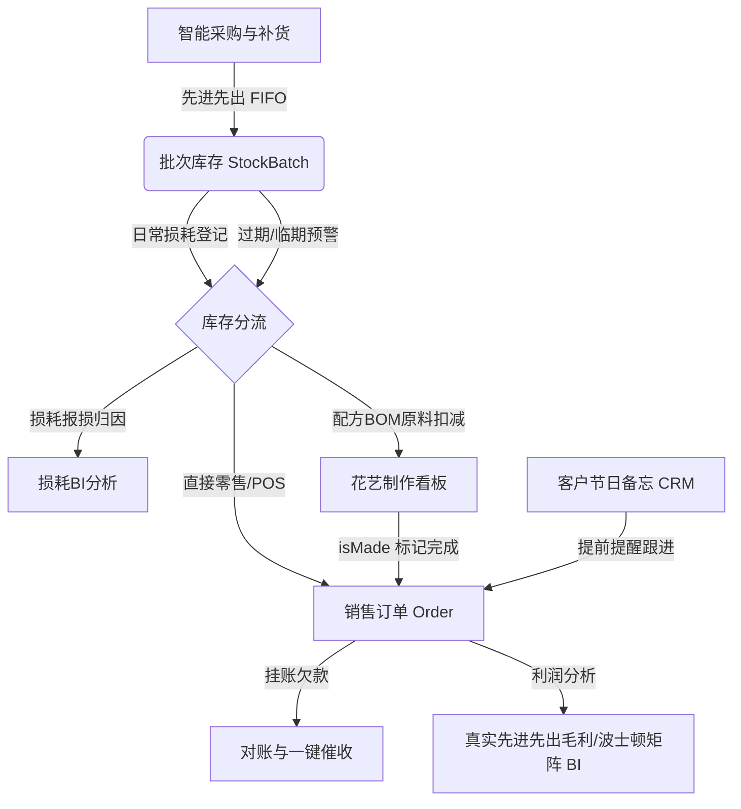

# 🌸 鲜花进销存与收银系统 - 对标千牛与优秀电商商家端的经营优化提案

在现代电商与本地生活服务中，像**千牛（淘宝/天猫商户端）**、**美团商家版**、**有赞零售**等优秀商家后台，其核心价值已不仅是单纯的“记账工具”，而是**“经营决策与效率提升引擎”**。

鲜花行业由于**生命周期极短（易腐生鲜）、高度依赖花艺配方（BOM组合）、节日驱动属性强（高频爆单）、批发零售混合（常有欠款挂账）**，对经营管理有着极为苛刻的要求。

基于本项目的现有架构（Nuxt 4 + Ant Design Vue 4 + Prisma + SQLite），本提案对标行业一流电商后台的经营逻辑，提出以下五大黄金优化模块。

---

## 🗺️ 鲜花品类核心经营全生命周期闭环

在成熟的电商管理中，商品、库存、资金和客户是环环相扣的。以下是为本项目设计的优化闭环流程：

---

## 💎 五大核心优化模块设计

### 一、 🌸 场景一：可视化花艺制作看板（Fulfillment & Recipe Dashboard）
> **对标千牛/美团外卖**：打单发货中心与出餐制作看板。

#### 1. 经营痛点
预售订单（如 520 节日预定、婚礼花束）需要提前制作。花艺师在包花时有两大痛点：
- **容易出错**：经常看错或漏看“贺卡内容”和“特别备注”。
- **配方库存无法追踪**：一个混搭花束（如“一心一意”红玫瑰花束）售出后，系统只记录了成品的销售，无法自动扣减原料库存（红玫瑰*11、满天星*1、包装纸*2），导致花材实际库存与系统严重对不上。

#### 2. 优化方案
将现有的 `app/pages/orders/preparation.vue` 和 `app/pages/pos/preparation.vue` 升级为**“智能花艺制作台”**：
- **卡片式排单看板**：按配送/自提时间（`deliveryTime`）和优先级（`isUrgent`）排序，分为“待制作”、“制作中”、“已制作”。
- **大字贺卡快照**：卡片上醒目展示收货人、送达时间、贺卡内容（支持一键复制或模拟打印，避免誊抄出错）。
- **配方BOM可视化**：自动读取 `ProductRecipe`，列出该花束所需的全部花材原料。
- **一键制作与库存扣减**：花艺师在平板上一键勾选“制作完成 (`isMade = true`)”，系统自动按配方扣减对应的花材原材料库存。

---

### 二、 🍂 场景二：生鲜损耗登记与报损分析系统（Waste & Shrinkage Management）
> **对标有赞零售/生鲜后台**：生鲜行业的利润都是从损耗里省出来的。

#### 1. 经营痛点
鲜花损耗率极高（通常在15%-30%）。目前系统虽然有库存变动流水，但缺少**专门的报损入口**和**损耗原因归因**。老板只知道亏了钱，却不知道花是“在库里放烂的”、“运输压坏的”、“包花切掉的”还是“当做样品摆放的”。

#### 2. 优化方案
- **快捷报损登记**：在库存列表（`stocks`）增加“损耗报损”按钮，支持店员快速录入报损数量，并强制选择**损耗原因**（如：过期变质、制作损耗、物流损坏、陈列样品、客户退单）。
- **损耗 BI 报表**：在经营报表（`reports`）中增加“损耗分析分析图表”，展示损耗金额占进货额的比例，以及“损耗原因分布饼图”。
- **经营启发**：帮助老板精确识别哪个品种的鲜花损耗率最高，从而针对性地收紧该品种的采购量。

---

### 三、 📅 场景三：客户重要节日提醒与一键对账催款（CRM & Receivable Optimizer）
> **对标有赞 CRM & 财务后台**：私域流量运营与账期资金流加速。

#### 1. 经营痛点
- 鲜花购买具有极强的“场景与时间驱动性”（如爱人情人节、生日、纪念日等）。如果客户忘记，商家就失去了生意。
- 花店（尤其是做鲜花批发的店）经常存在客户挂账欠款，店员对账、催款十分低效，经常需要把账单抄在纸上拍照发给客户。

#### 2. 优化方案
- **客户节日备忘录 (CRM 提醒)**：
  - 在客户详情/编辑表单中增加“节日备忘”子表（如：节日名称“爱人生日”，日期“05-20”，是否公历/农历）。
  - **智能提醒**：系统在节日临近前 3 天，自动在系统顶部导航栏的“铃铛（Notification）”中推送“节日跟进提醒”（例如：“客户【张总】的爱人生日将在3天后到来，建议回访推荐 11枝红玫瑰花束”）。
- **一键催收账单生成器 (Receivable Tool)**：
  - 针对有欠款（`totalOwed > 0`）的客户，在客户对账页面（`payments`）提供“生成对账单”功能。
  - 生成一张精美的、适合手机保存的**“账单图片/卡片”**，列出欠款明细、未付订单，并附带后台配置好的“微信/支付宝收款二维码”，支持一键复制账单文字或截图发送给客户，极大地提升回款效率。

---

### 四、 📦 场景四：智能采购建议与临期降价决策（Supply Chain Intelligent Recommender）
> **对标千牛供应链/京东商家后台**：基于周转率与保质期的智能采购。

#### 1. 经营痛点
鲜花常温保质期仅为 5-7 天，冷库中也仅有 10-14 天。商家采购全凭感觉。进多了导致过期报损，进少了导致客户想买时断货。

#### 2. 优化方案
- **自动周转率计算**：系统统计每种商品在过去 7 天或 30 天的日均销量。
- **智能采购建议 (Inventory Recommender)**：
  - 结合商品定义的“安全库存（Min Stock）”、当前有效批次总库存、日均销量。
  - 自动在库存主页展示“采购建议列表”：`建议采购量 = 预售订单数 + 安全库存 - 当前可用库存`。
- **临期倾销预警**：
  - 针对在库时间长、过期天数临近（如保质期剩 2 天）的 `StockBatch`。
  - 在系统仪表盘展示“临期特价处理建议”，提示店员在 POS 端发起“满减”或手动打折促销。

---

### 五、 📊 场景五：先进先出（FIFO）毛利分析与商品波士顿矩阵（BI Profit Dashboard）
> **对标千牛生意参谋**：从“糊涂账”到“数字化精细运营”。

#### 1. 经营痛点
鲜花进货价波动极大（比如情人节前红玫瑰进价可能比平时翻 3-5 倍）。普通的“售价 - 默认进价”根本算不准利润。目前系统虽然有了 `StockBatch` 中的 `costPrice`（实际成本），但没有将每一笔订单销售的 `OrderItem` 与扣减的 `StockBatch` 成本关联计算出“真实的先进先出利润”。

#### 2. 优化方案
- **FIFO 真实销售毛利**：在销售订单出货绑定批次时，基于实际绑定的 `StockBatch.costPrice` 与 `OrderItem.unitPrice` 计算每笔订单的纯毛利：`毛利 = 售价 - 实际批次成本 - 折扣 - 损耗`。
- **商品贡献度分析（波士顿矩阵）**：
  - 自动将商品按“销量”和“毛利率”划分为四个象限，并在 `reports` 页面以散点图呈现：
    - **明星商品** (高销量、高毛利)：如特色混搭花束。建议加大推广。
    - **金牛商品** (高销量、低毛利)：如单枝康乃馨、配叶。用于到店引流，需严控耗损。
    - **问号商品** (低销量、高毛利)：如高档进口永生花。需考虑加大营销或捆绑销售。
    - **瘦狗商品** (低销量、低毛利)：如受众小的配花。建议优化下架。

---

> [!NOTE]
> **本提案完全基于您现有的数据模型进行轻量化扩展开发**。所有的表结构设计如 `StockBatch`、`ProductRecipe`、`Order` 和 `Customer` 都已经为上述功能预留了绝佳的基础，绝非空中楼阁。
